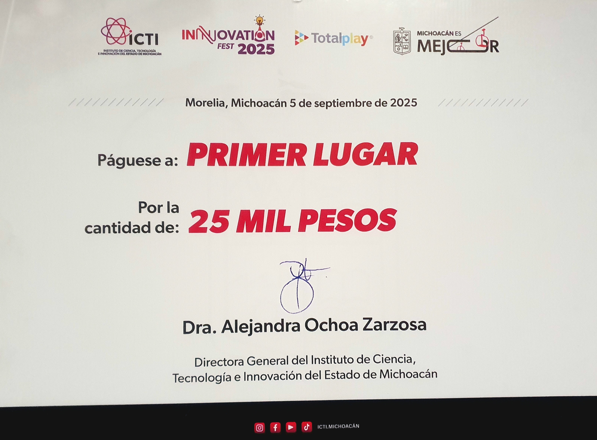
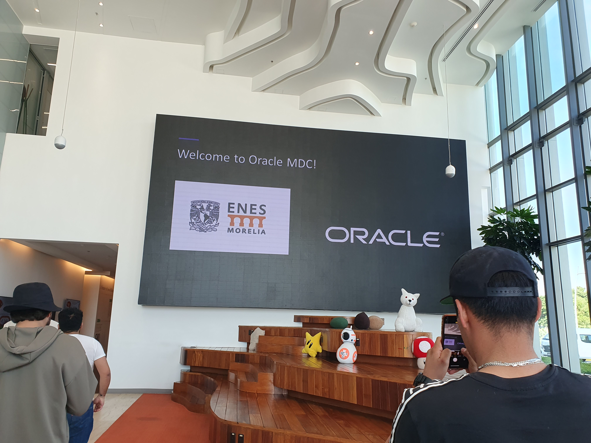
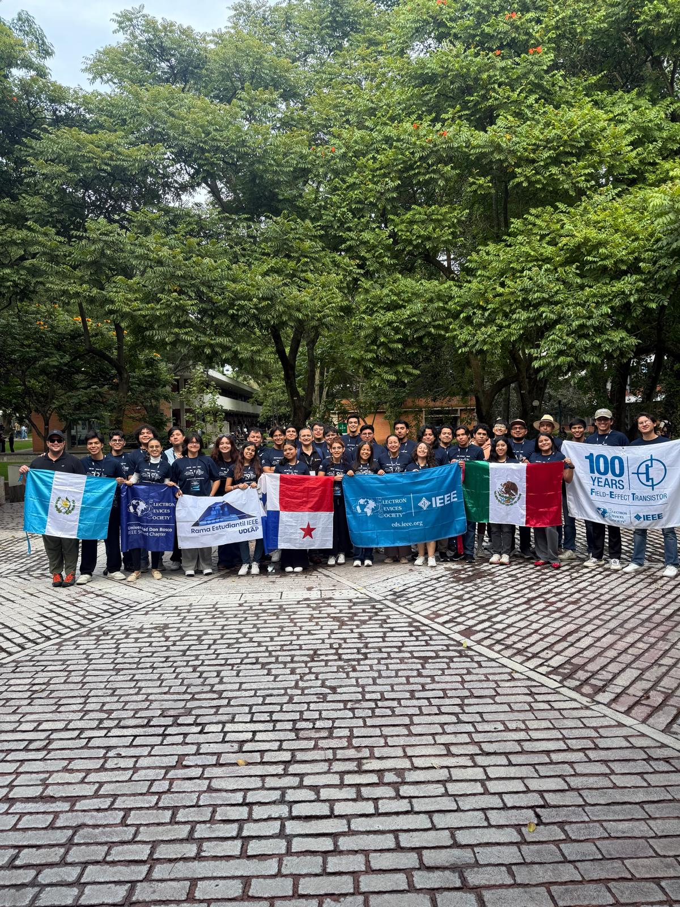
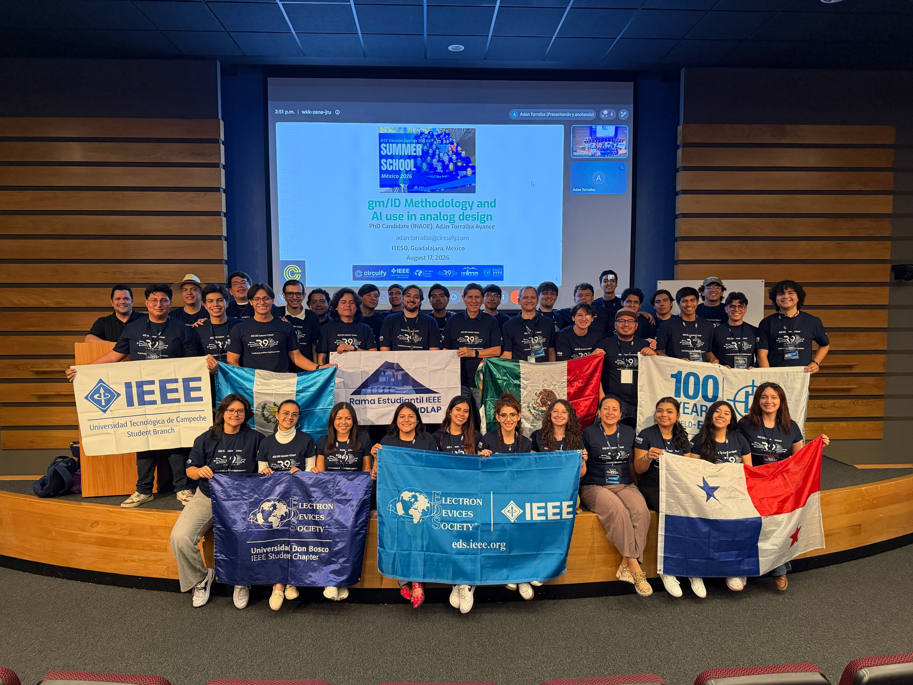
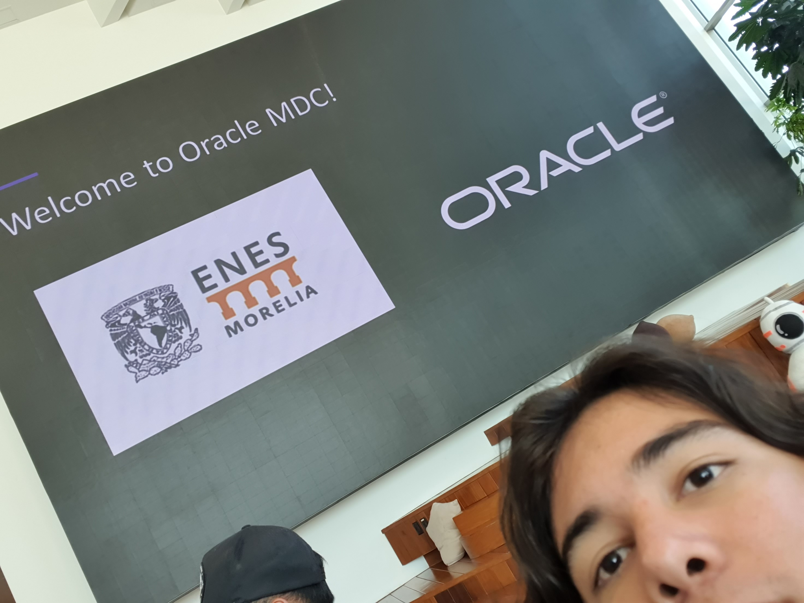
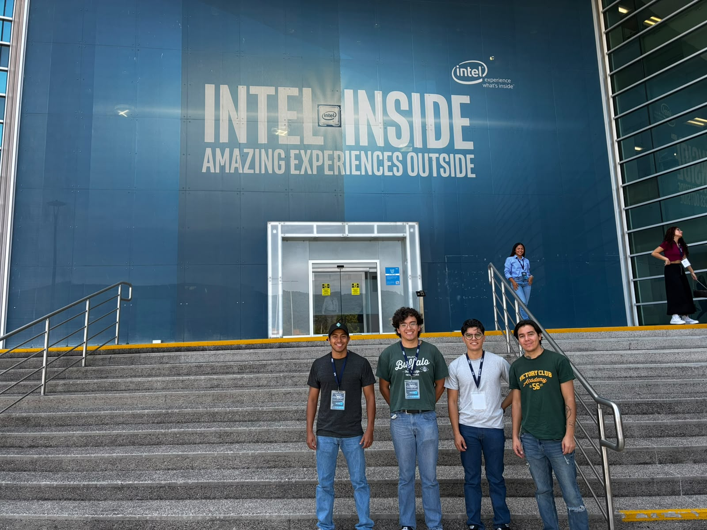
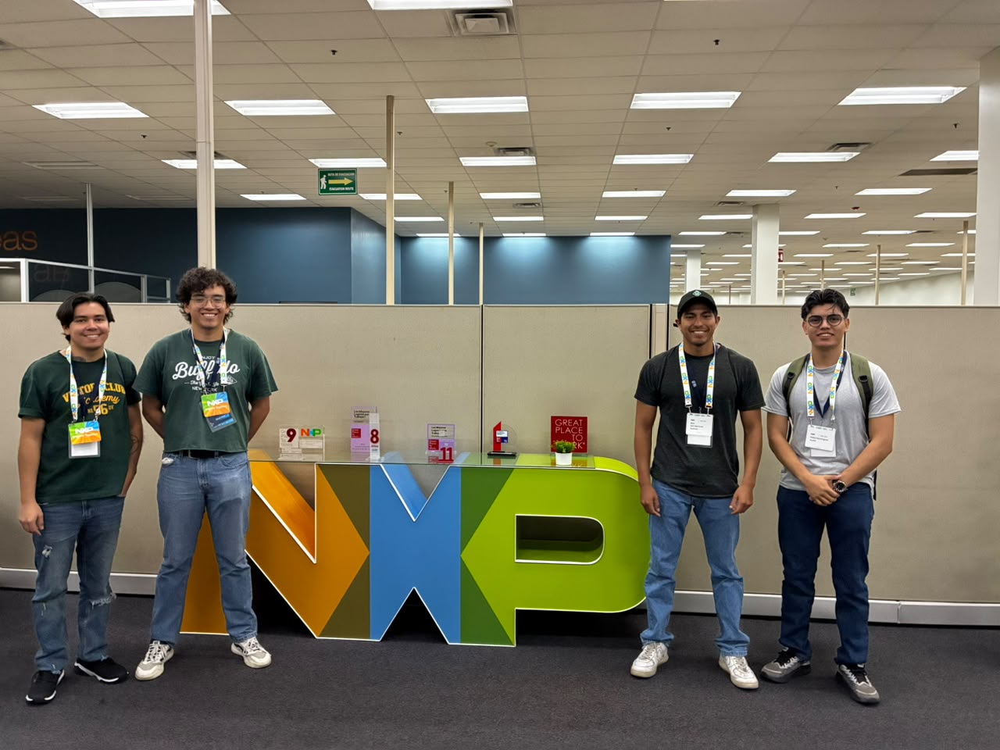

::: hero
::: hero__text
[Ciencia de datos · Machine learning · Aplicaciones]{.eyebrow}

# Guillermo Pineda Ramírez

[Construyo soluciones de datos de punta a punta: convierto datos en decisiones y modelos en productos.]{.lead}

Primer lugar en el **Hackathon Innovation Fest 2025** del ICTI de Michoacán, donde apliqué machine learning para optimizar la logística y la siembra en el campo michoacano. Estudio Tecnologías para la Información en Ciencias en la **UNAM (Campus Morelia)** y me interesan el ML aplicado, la visualización de datos y llevar modelos a producción.

::: cta-row
[Ver proyectos](proyectos/index.qmd){.primary}
[Contacto](#contacto){.secondary}
:::
:::

::: hero__photo
{.nolightbox}
:::
:::

::: sec
::: sec__head
## Mi stack tecnológico

Herramientas con las que construyo análisis, modelos y aplicaciones.
:::


:::

::: sec
::: sec__head
## Experiencia y logros

Resultados y experiencias que respaldan mi trabajo.
:::

::: cards
::: card-item

[1er lugar · 2025]{.tag}

### Hackathon Innovation Fest 2025

Primer lugar en el Innovation Fest 2025 del ICTI de Michoacán con un enfoque de machine learning para mejorar la eficiencia, seguridad y optimización de la cadena de abastecimiento, la logística y la siembra en el campo michoacano.
:::

::: card-item

[Visitas técnicas]{.tag}

### Centros tecnológicos

Recorrí instalaciones de Oracle, Intel y NXP para entender de cerca sistemas complejos, hardware y soluciones escalables de la industria.
:::

::: card-item

[Formación]{.tag}

### EDS International Summer School 2026

Curso de verano sobre diseño de circuitos integrados: de los dispositivos a la implementación en silicio (Guadalajara, 2026).
:::
:::
:::

::: sec
::: sec__head
## Galería

Momentos de proyectos, formación y visitas técnicas. Haz clic en una imagen para ampliarla.
:::

::: gallery
<figure class="shot">
  
  <figcaption>Primer lugar · Innovation Fest 2025</figcaption>
</figure>
<figure class="shot">
  
  <figcaption>EDS International Summer School</figcaption>
</figure>
<figure class="shot">
  
  <figcaption>EDS Summer School · segunda sesión</figcaption>
</figure>
<figure class="shot">
  
  <figcaption>Visita a Oracle</figcaption>
</figure>
<figure class="shot">
  
  <figcaption>Oracle · segunda visita</figcaption>
</figure>
<figure class="shot">
  
  <figcaption>Visita a Intel</figcaption>
</figure>
<figure class="shot">
  
  <figcaption>Visita a NXP</figcaption>
</figure>
:::
:::

::: sec
::: sec__head
## Contacto
:::

Si quieres colaborar o platicar sobre tecnología, ciencia de datos o proyectos aplicados, aquí puedes encontrarme:

- **Email:** [pinedaramirezmemo@gmail.com](mailto:pinedaramirezmemo@gmail.com)
- **LinkedIn:** [guillermo-pineda-ramirez](https://www.linkedin.com/in/guillermo-pineda-ramirez/)
- **GitHub:** [DeyWort](https://github.com/DeyWort)
:::
